<div align="center">


<h1>Education Landing Zone</h1>

<p><strong>The Enterprise Standard for Academic Cloud Foundations and Research Enablement</strong></p>

[]()
[]()
[]()
[]()

<br/>

> **"Empowering the future of learning and research through industrialized cloud foundations."** 
> Education Landing Zone is a flagship repository designed to enable universities, schools, and research institutions to design, deploy, and govern cloud environments at institutional scale through secure guardrails and academic-centric blueprints.

</div>

---

## 🏛️ Executive Summary

**Education Landing Zone (ELZ)** is a flagship repository designed for University CIOs, Research Computing Leaders, and School District IT Departments. As education shifts towards hybrid learning and data-intensive research, the need for a standardized, secure, and compliant cloud foundation becomes the critical path to digital transformation.

This platform provides an industrialized approach to **Academic Cloud Foundations**, delivering production-ready **Multi-Campus Architectures**, **Research HPC Enclaves**, **Student Experience Portals**, and **FERPA-Compliant Governance**. It leverages **Azure**, **AWS**, and **GCP**, with a primary focus on Microsoft ecosystem alignment for institutional efficiency.

---

## 💡 Why Education Landing Zones Matter

Education institutions face unique challenges that traditional enterprise landing zones do not address:
- **Shared vs. Distributed IT**: Balancing central governance with departmental autonomy (e.g., Medicine vs. Engineering).
- **Research Mobility**: Rapidly provisioning high-performance compute for short-term research grants.
- **Privacy Compliance**: Ensuring student data is protected under FERPA, HIPAA, and regional privacy laws.
- **Cost Sensitivity**: Managing tight budgets through granular chargeback and grant-based billing.

---

## 🚀 Business Outcomes

### 🎯 Strategic Academic Impact
- **Accelerated Research**: Reducing the time-to-compute for researchers from months to minutes.
- **Enhanced Student Experience**: Providing high-availability learning platforms and digital campus services.
- **Institutional Governance**: Standardizing security and identity across a complex multi-campus landscape.
- **FinOps Excellence**: Optimizing cloud spend through academic-specific showback/chargeback models.

---

## 🏗️ Technical Stack

| Layer | Technology | Rationale |
|---|---|---|
| **Governance Engine** | Python, Terraform, Bicep | High-performance orchestration of institutional guardrails and departmental enclaves. |
| **Control Plane** | FastAPI | High-performance API for landing zone provisioning, cost tracking, and identity sync. |
| **Frontend** | React 18, Vite | Premium portal for executive dashboards, campus operations, and research boards. |
| **IaC Foundation** | Terraform + Bicep | Multi-cloud consistency with deep Azure integration for Microsoft 365 alignment. |
| **Database** | PostgreSQL | Centralized repository for campus inventory, policy state, and grant billing. |
| **Observability** | Prometheus / Grafana | Real-time monitoring of campus uptime, policy drift, and research resource usage. |

---

## 📐 Architecture Storytelling: 75+ Diagrams

### 1. Executive High-Level Architecture
The holistic vision of the academic cloud transformation journey.

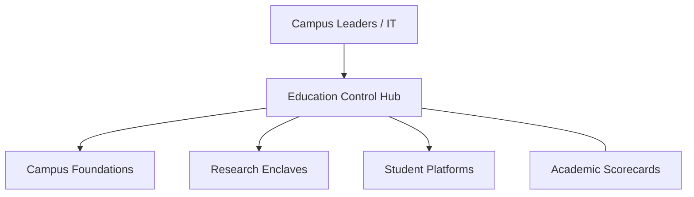

### 2. Detailed Landing Zone Topology
The internal service boundaries and management layers of the institutional foundation.

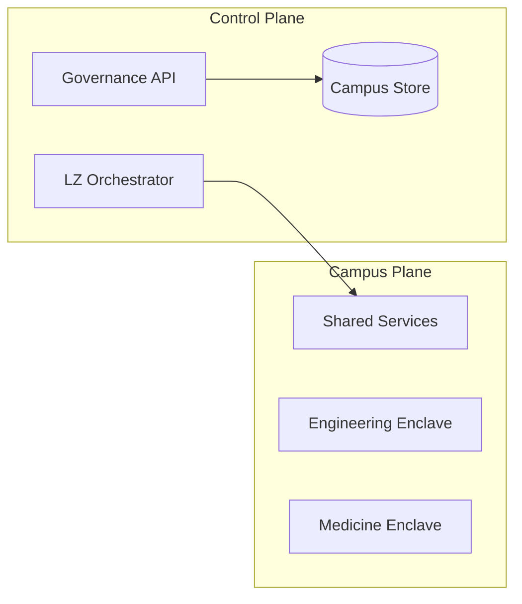

### 3. Campus to Cloud Connectivity Path
Tracing institutional traffic from the physical campus network to the cloud landing zone.

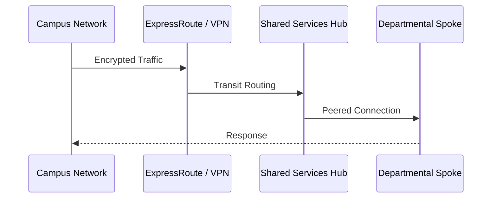

### 4. Control Plane Architecture
The "Brain" of the framework managing global institutional definitions and policies.

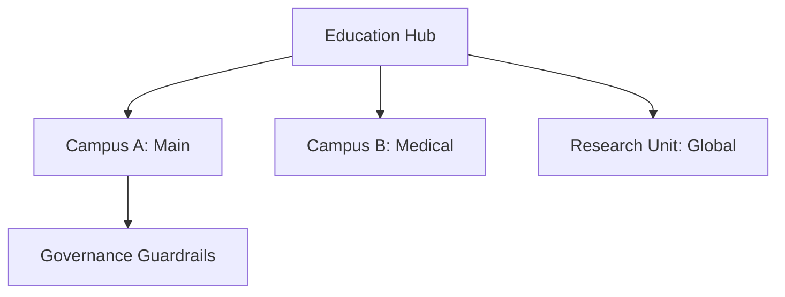

### 5. Multi-Cloud Topology
Synchronizing academic standards across Azure, AWS, and GCP.

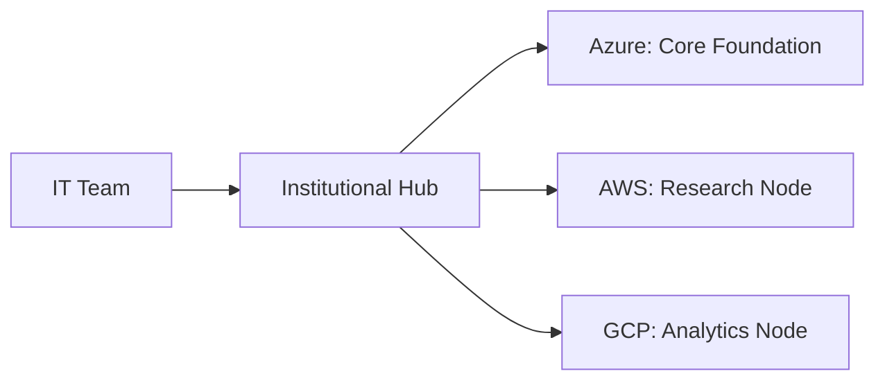

### 6. Regional Deployment Model
Hosting shared services and departmental workloads close to the primary campus for low latency.

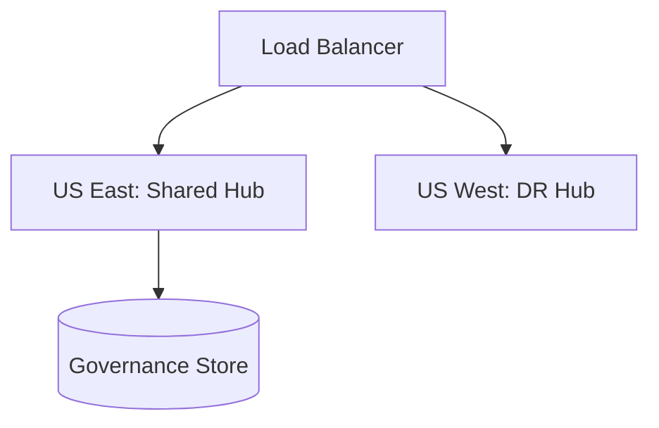

### 7. DR Failover Model
Ensuring platform continuity for critical student and administrative services.

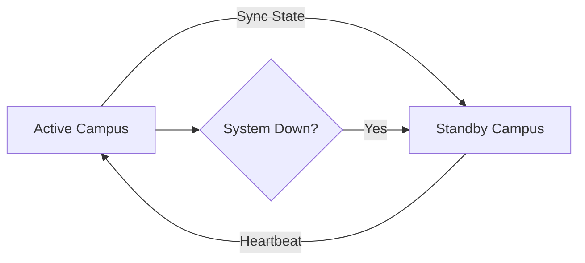

### 8. API Gateway Architecture
Securing and throttling the entry point for institutional orchestration and reporting.

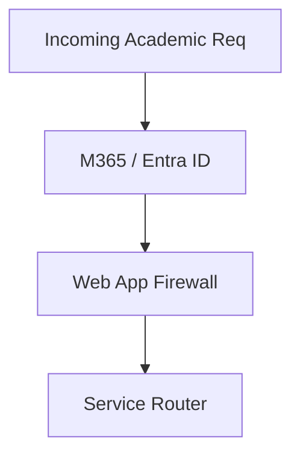

### 9. Queue Worker Architecture
Managing long-running provisioning and research HPC tasks at scale.

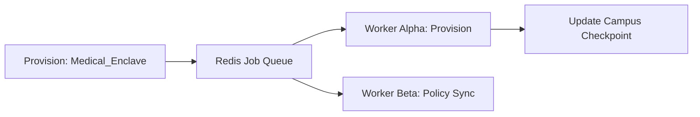

### 10. Dashboard Analytics Flow
How raw cloud logs become executive academic engineering scorecards.

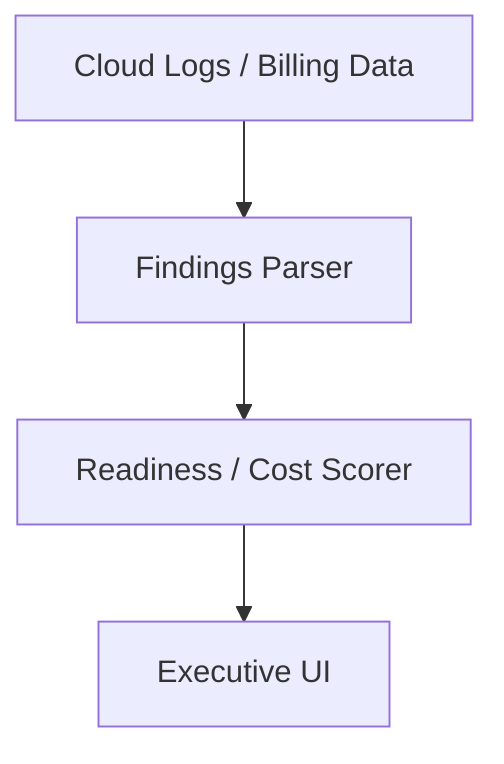

### 11. Management Group Hierarchy
Organizing campus subscriptions into a logical governance structure.

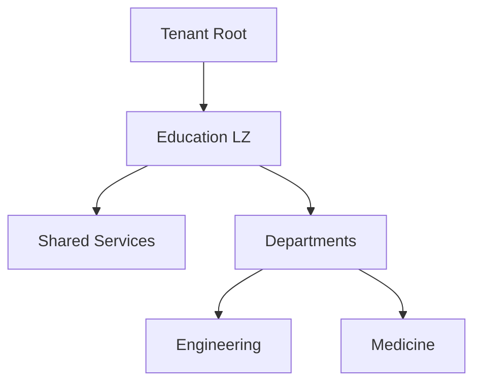

### 12. Subscription/Account Model
Standardizing the delivery of cloud resources through "Academic Subscriptions."

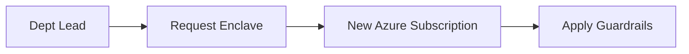

### 13. Multi-Campus Tenant Segmentation
Managing separate or unified tenants across satellite campuses.

```mermaid
graph TD
    Main[Main Campus] <-> Med[Medical Campus]
    Main <-> Law[Law School]
```

### 14. Shared Services Hub Model
Centralizing core infrastructure (Firewalls, DNS, Identity) for cost efficiency.

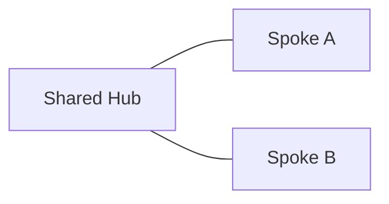

### 15. Hub-Spoke Network Topology
Designing a secure, peered network for inter-departmental communication.

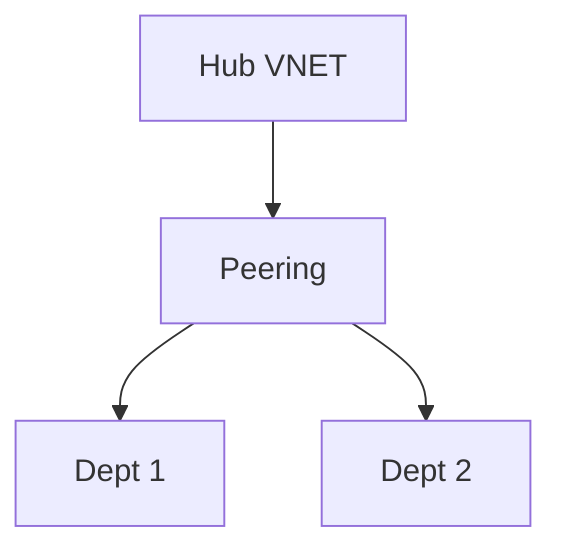

### 16. Transit Connectivity Workflow
Managing traffic between cloud enclaves and on-premise research labs.

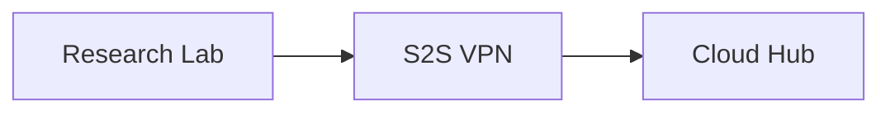

### 17. DNS Architecture
Centralized DNS resolution across global academic sites.

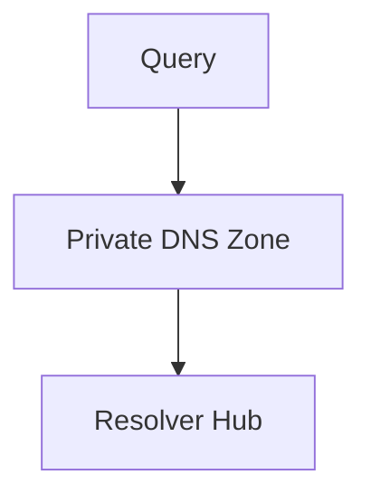

### 18. Identity Trust Boundaries
Defining where institutional identity ends and departmental or guest identity begins.

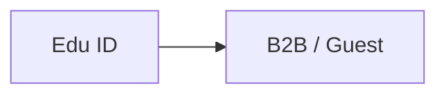

### 19. Environment Separation Model
Strictly isolating Sandbox, Development, and Production academic environments.

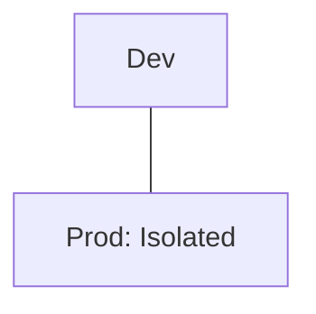

### 20. Sandbox Lifecycle Flow
Automating the creation and automated cleanup of short-term research sandboxes.

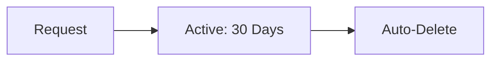

### 21. LMS Hosting Reference Model
Scaling Learning Management Systems (Canvas, Moodle) for peak enrollment.

```mermaid
graph TD
    LB[LB] --> Web[LMS App] --> DB[LMS Database]
```

### 22. SIS Integration Workflow
Securely syncing Student Information Systems with cloud learning platforms.

```mermaid
graph LR
    SIS[SIS On-Prem] --> Sync[Secure API] --> Cloud[Cloud SIS Data]
```

### 23. Student Portal Architecture
Delivering a unified, highly-available digital experience for students.

```mermaid
graph TD
    Portal[Portal App] --> API[Student API] --> Data[M365/SIS]
```

### 24. Faculty Collaboration Model
Secure sharing of research and teaching materials via Teams and SharePoint.

```mermaid
graph LR
    Fac1[Professor] <-> Fac2[Researcher]
```

### 25. Digital Exam Platform Pattern
Hardened environments for secure digital testing and examination.

```mermaid
graph TD
    Exam[Exam App] --> Lock[Secure Browser]
```

### 26. VDI Computer Lab Model
Delivering specialized software to students via virtual desktops.

```mermaid
graph LR
    Student[Home] --> VDI[Virtual Lab Node]
```

### 27. Library Systems Integration
Cloud-native hosting for digital catalogs and institutional archives.

```mermaid
graph TD
    Catalog[Catalog API] --> Search[Search Index]
```

### 28. Smart Classroom IoT Model
Managing connected classroom tech at institutional scale.

```mermaid
graph LR
    Sensor[IoT Node] --> Hub[Edge Hub]
```

### 29. Campus App Architecture
Mobile-first backend for student safety, maps, and schedules.

```mermaid
graph TD
    Mobile[App] --> Backend[Campus API]
```

### 30. Seasonal Enrollment Scaling
Using auto-scaling to handle the 10x traffic spike during enrollment weeks.

```mermaid
graph LR
    Enroll[Enrollment Week] --> Scale[Scale Out Nodes]
```

### 31. Research HPC Cluster Model
Provisioning high-performance compute clusters for intensive simulations.

```mermaid
graph TD
    Head[Head Node] --> Workers[HPC Compute Fleet]
```

### 32. GPU Lab Architecture
Delivering GPU-accelerated workloads for AI/ML research.

```mermaid
graph LR
    Lab[AI Lab] --> GPU[Nvidia/AMD Fleet]
```

### 33. Genomics Pipeline Pattern
Automating high-throughput sequence analysis workflows.

```mermaid
graph TD
    Raw[Raw Data] --> Pipeline[NextFlow/Snakemake] --> Result[Insights]
```

### 34. Secure Research Enclave
Creating air-gapped or restricted zones for sensitive data research.

```mermaid
graph LR
    SRE[Secure Enclave] ---|Gateway| Internet[Blocked]
```

### 35. Data Lake Architecture
Centralizing institutional research and administrative data for analysis.

```mermaid
graph TD
    Raw[Raw] --> Bronze[Bronze] --> Silver[Silver] --> Gold[Gold]
```

### 36. Analytics Workspace Model
Empowering data scientists with pre-configured cloud workspaces.

```mermaid
graph LR
    Scientist[User] --> NB[Jupyter/Databricks]
```

### 37. ML Research Platform
End-to-end MLOps for academic machine learning projects.

```mermaid
graph TD
    Train[Train] --> Deploy[Model Registry]
```

### 38. Cross-Institution Collaboration Flow
Securing data sharing between multiple universities for joint grants.

```mermaid
graph LR
    Uni_A[Uni A] <-> Hub[Collab Hub] <-> Uni_B[Uni B]
```

### 39. Data Sharing Governance
Managing data usage agreements (DUAs) through automated policy enforcement.

```mermaid
graph TD
    Data[Data Set] --> Policy[Access Control]
```

### 40. Backup Archive Lifecycle
Tiered storage for multi-decade preservation of research data.

```mermaid
graph LR
    Hot[Active] --> Cool[Archive] --> Cold[Deep Glacier]
```

### 41. OIDC / SSO Auth Flow
Standardizing institutional access via Entra ID or Shibboleth.

```mermaid
graph LR
    User[User] --> SSO[Institutional SSO]
```

### 42. RBAC Model
Defining granular roles for Faculty, Students, Researchers, and Admins.

```mermaid
graph TD
    Role[Professor] --> Perm[Manage Course Data]
```

### 43. Privileged Access Workflow
Securing high-privilege IT actions through Just-In-Time (JIT) access.

```mermaid
graph LR
    Admin[Admin] --> JIT[JIT Request] --> Auth[Access Granted]
```

### 44. Secrets Management Flow
Securing API keys and certificates across the academic estate.

```mermaid
graph TD
    App[App] --> KV[Key Vault]
```

### 45. FERPA Data Boundary Model
Ensuring student record data never leaves the compliant boundary.

```mermaid
graph LR
    SIS[SIS Records] --> Zone[FERPA Zone]
```

### 46. Data Classification Lifecycle
Automatically tagging institutional data as Public, Internal, or Restricted.

```mermaid
graph TD
    Scan[Scan] --> Tag[Label: Restricted]
```

### 47. Audit Logging Architecture
Centralized tracking of all administrative and academic access.

```mermaid
graph LR
    Action[Action] --> Hub[Audit Store]
```

### 48. Vulnerability Remediation Flow
Detecting and patching security risks in student-managed environments.

```mermaid
graph TD
    Detect[Vuln Found] --> Ticket[Auto-Remediate]
```

### 49. Security Operations Model
The institutional path for detecting and responding to campus cyber threats.

```mermaid
graph LR
    Soc[SOC] --> Response[Incident Team]
```

### 50. Incident Response Workflow
Standardized steps for handling a data breach or system outage.

```mermaid
graph TD
    Event[Event] --> Assess[Assess] --> Contain[Contain]
```

### 51. Budget Allocation Workflow
Linking cloud spend to specific grants or department codes.

```mermaid
graph LR
    Grant[Grant ID] --> Spend[Compute Usage]
```

### 52. Chargeback / showback Model
Visualizing cloud consumption for departmental accountability.

```mermaid
graph TD
    Report[Usage Report] --> Dept[Dean of Medicine]
```

### 53. Scholarship Grant Project Billing
Managing the unique financial lifecycle of grant-funded cloud projects.

```mermaid
graph LR
    Grant[Grant] --> Wallet[Allocated Budget]
```

### 54. Capacity Planning Workflow
Predicting future campus compute needs based on enrollment trends.

```mermaid
graph TD
    Trend[Enrollment] --> Forecast[Capacity Needs]
```

### 55. Patch Management Lifecycle
Keeping institutional OS and platforms secure and up-to-date.

```mermaid
graph LR
    Update[Patch] --> Test[Test Env] --> Rollout[Campus Wide]
```

### 56. Metrics Pipeline
Monitoring the performance of academic platforms and landing zone health.

```mermaid
graph TD
    Hub[Hub] --> Prom[Prometheus]
```

### 57. Logging Architecture
The unified path for telemetry from student apps to central IT.

```mermaid
graph LR
    App[Student App] --> Log[Forwarder] --> Hub[Loki/Elastic]
```

### 58. Tracing Model
Observing distributed requests across complex campus service meshes.

```mermaid
graph TD
    Portal[Portal] --> API[SIS API] --> DB[Database]
```

### 59. Release Pipeline Governance
Governing software releases for critical institutional systems.

```mermaid
graph LR
    Code[Code] --> Gate[Security Check] --> Deploy[Live]
```

### 60. Change Management Workflow
Standardizing changes to core institutional infrastructure.

```mermaid
graph TD
    Req[Change Req] --> CAB[Review Board] --> Execute[Approve]
```

### 61. Executive KPI Review Cycle
The quarterly review of cloud readiness and budget for the Provost.

```mermaid
graph LR
    Stats[Stats] --> Deck[Executive Summary]
```

### 62. Student Experience Scorecard
Measuring digital friction and platform availability for students.

```mermaid
graph TD
    Score[Experience: 9.2/10]
```

### 63. Research Enablement Model
Quantifying the value added to research through cloud foundations.

```mermaid
graph LR
    Compute[Compute] --> Pubs[Publications/Grants]
```

### 64. Campus Benchmark Comparison
Comparing the cloud maturity of different departments or satellite campuses.

```mermaid
graph LR
    Main[Main: 94%] vs Satellite[Satellite: 82%]
```

### 65. Sustainability Dashboard Flow
Monitoring the green energy usage and carbon footprint of campus IT.

```mermaid
graph TD
    Pwr[KWh] --> Carbon[CO2 Saved]
```

### 66. Accreditation Evidence Workflow
Generating documentation for institutional or program accreditation.

```mermaid
graph LR
    Data[System Data] --> Report[Accreditation Proof]
```

### 67. Quarterly Planning Cadence
Aligning cloud strategy with the academic semester calendar.

```mermaid
graph TD
    Fall[Fall Term] --> Winter[Winter Break Projects]
```

### 68. Board Reporting Model
The high-level summary of cloud risk and value for the Board of Trustees.

```mermaid
graph LR
    Board[Board] <-> CIO[CIO Strategy]
```

### 69. Education Maturity Roadmap
The journey from "Legacy On-Prem" to "Industrialized Academic Cloud."

```mermaid
graph LR
    S1[Ad-Hoc] --> S4[Automated Governance]
```

### 70. Continuous Improvement Loop
The ultimate feedback cycle for institutional excellence.

```mermaid
graph LR
    Test[Test] --> Learn[Learn] --> Evolve[Evolve]
    Evolve --> Test
```

### 71. Multi-country Institution Model
Governing global satellite campuses under a single landing zone.

```mermaid
graph TD
    HQ[HQ] --> BranchA[London] --> BranchB[Singapore]
```

### 72. Alumni Platform Integration
Extending cloud services to lifelong learning and alumni engagement.

```mermaid
graph LR
    Alumni[Alumni] --> App[Engagement Portal]
```

### 73. AI Tutoring Architecture
Delivering AI-powered tutoring assistants at scale.

```mermaid
graph TD
    Prompt[Student] --> LLM[AI Tutor] --> Result[Help]
```

### 74. Smart Campus Digital Twin
Real-time simulation and optimization of the physical campus at the edge.

```mermaid
graph LR
    Physical[Campus] <-> Twin[Digital Model]
```

### 75. Innovation Portfolio Roadmap
Planning the next 36 months of institutional cloud evolution.

```mermaid
graph TD
    Now[Now] --> Year3[Research AI Core]
```

---

## 🔬 Academic Cloud Methodology

### 1. The Institutional Pillars
Our platform is built on four core pillars:
- **Autonomy**: Providing departments with the freedom to innovate within secure boundaries.
- **Grant-Centricity**: Aligning cloud resources and costs directly with research grants.
- **Trust**: Ensuring student and faculty data is governed by the highest privacy standards.
- **Efficiency**: Shared services hub models to reduce institutional technical debt.

### 2. FERPA & Privacy Governance
We provide automated "Privacy Guardrails" that ensure student records (SIS) and research data remain within compliant, geographically-locked zones.

---

## 🚦 Getting Started

### 1. Prerequisites
- **Terraform** (v1.5+).
- **Bicep** (latest).
- **Azure Subscription** (Education or Enterprise).

### 2. Local Setup
```bash
# Clone the repository
git clone https://github.com/Devopstrio/education-lz.git
cd education-lz

# Start the Education Governance Control Plane
docker-compose up --build
```
Access the Dashboard at `http://localhost:3000`.

---

## 🛡️ Governance & Security
- **Identity First**: Deep integration with Entra ID and M365 for seamless academic access.
- **Policy as Code**: Every landing zone deployment is validated against the institutional security policy.
- **FinOps**: Built-in grant-based billing and departmental showback engines.

---
<sub>&copy; 2026 Devopstrio &mdash; Engineering the Future of Industrialized Academic Cloud.</sub>
