<div align="center">


<h1>Education Landing Zone</h1>

<p><strong>The Institutional-Grade Platform for Standardized Education Foundations, Learning Governance Orchestration, and Multi-Cloud Campus Ecosystem Delivery.</strong></p>

[]()
[]()
[]()

<br/>

> **"Industrializing learning delivery to automate education foundations."** 
> **Education Landing Zone (Edu-LZ)** is an enterprise-grade platform designed to provide a secure, measurable, and highly automated foundation for global education operations. It orchestrates the complex lifecycle of learning—from student enrollment and academic record storage in the lakehouse to curricular transformation and unified campus auditing.

</div>

---

## 🏛️ Executive Summary

Fragmented education silos and manual learning workflows are strategic operational liabilities; lack of centralized academic orchestration is a primary barrier to organizational cloud maturity. Organizations fail to maintain a secure education foundation not because of a lack of students, but because of fragmented learning standards, lack of automated academic validation, and an inability to orchestrate learning planes with operational precision.

This platform provides the **Learning Intelligence Plane**. It implements a complete **Education-LZ-as-Code Framework**, enabling Education and Platform teams to manage global education foundations as first-class citizens. By automating the identification of enrollment bottlenecks through real-time telemetry analysis and orchestrating the deployment of secure performance-driven education policies, we ensure that every organizational service—from core learning lakes to distributed academic products—is governed by default, audited for history, and strictly aligned with institutional education frameworks.

---

## 📐 Architecture Storytelling: Principal Reference Models

### 1. Principal Architecture: Global Education Landing Zone & Learning Intelligence Plane
This diagram illustrates the end-to-end flow from enrollment ingestion and multi-cloud orchestration to academic enforcement, quality validation, and institutional campus auditing.

```mermaid
graph LR
    %% Subgraph Definitions
    subgraph LearningIngress["Enrollment & Academic Ingress"]
        direction TB
        Students["Enrollment / Identity / Profile Fleets"]
        Academic_Apps["Curriculum / Portal / LMS Ops"]
        Assessments["Exam / Assessment / Credential Telemetry"]
    end

    subgraph IntelligenceEngine["Learning Intelligence Hub"]
        direction TB
        API["FastAPI Education Gateway"]
        LearningOrchestrator["Global Learning & Academic Hub"]
        Governance_Hub["Compliance & Contract Guardrail Hub"]
        AIOps_Validator["Drift & Quality Analysis Hub"]
    end

    subgraph OperationsPlane["Distributed Education Ecosystem"]
        direction TB
        ManagedLearningLakes["Managed Standardized Learning Lakes"]
        ActivePipelines["Managed Automated Learning Pipelines"]
        CampusSinks["Managed Infrastructure Delivery Hubs"]
    end

    subgraph OperationsHub["Institutional Education Hub"]
        direction TB
        Scorecard["Education Maturity Scorecard"]
        Analytics["Learning Flow & Readiness Velocity Stats"]
        Audit["Forensic Education Metadata Lake"]
    end

    subgraph DevOps["Education-LZ-as-Code Framework"]
        direction TB
        TF["Terraform Education Modules"]
        DriftBot["Learning & Config Drift Validator"]
        ChatOps["Education Operations Hub"]
    end

    %% Flow Arrows
    LearningIngress -->|1. Submit Enrollment| API
    API -->|2. Orchestrate Ingestion| LearningOrchestrator
    LearningOrchestrator -->|3. Apply Academic Guard| Governance_Hub
    Governance_Hub -->|4. Assess Drift| AIOps_Validator
    
    AIOps_Validator -->|5. Execute Provision| OperationsPlane
    OperationsPlane -->|6. Notify Status| ChatOps
    API -->|7. Visualize Health| Scorecard
    
    Scorecard -->|8. Track Maturity| Analytics
    Scorecard -->|9. Record Provision| Audit
    
    TF -->|10. Provision Backbone| IntelligenceEngine
    DriftBot -->|11. Inject Ingestion Risk| LearningOrchestrator
    Audit -->|12. Improve Operations| ManagedLearningLakes

    %% Styling
    classDef ingress fill:#f5f5f5,stroke:#616161,stroke-width:2px;
    classDef intel fill:#e8eaf6,stroke:#1a237e,stroke-width:2px;
    classDef operations fill:#e1f5fe,stroke:#01579b,stroke-width:2px;
    classDef ops fill:#ede7f6,stroke:#311b92,stroke-width:2px;
    classDef devops fill:#e8f5e9,stroke:#1b5e20,stroke-width:2px;

    class LearningIngress ingress;
    class IntelligenceEngine intel;
    class OperationsPlane operations;
    class OperationsHub ops;
    class DevOps devops;
```

### 2. The Learning Lifecycle Flow
The continuous path of an infrastructure platform from initial enrollment (identity) and access (portal) to active content (curriculum), assessment (exam), and institutional forensic auditing.

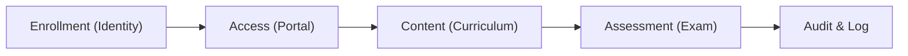

### 3. Distributed Education Topology
Strategically orchestrating standardized education landing zones across global university regions, diverse campuses, and multi-cloud targets, providing a unified institutional view of global education health and operational readiness.

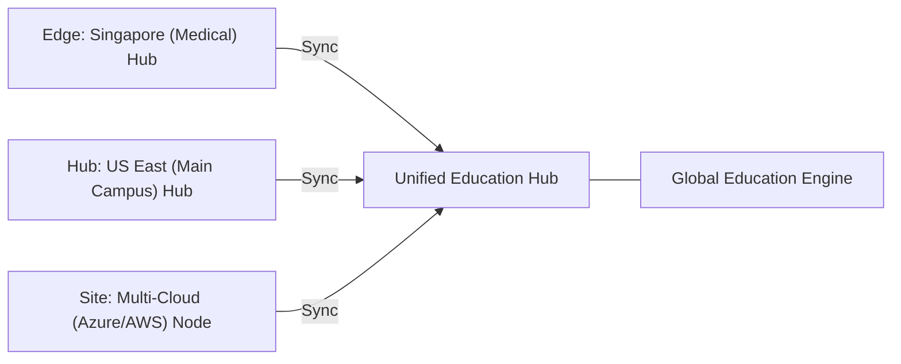

### 4. Student Data Privacy & High-Trust Data Plane Protection Flow
Executing complex logic for securing the bridge between registrar offices and learning management systems, ensuring every organizational identity is verified and every academic access is according to institutional standards.

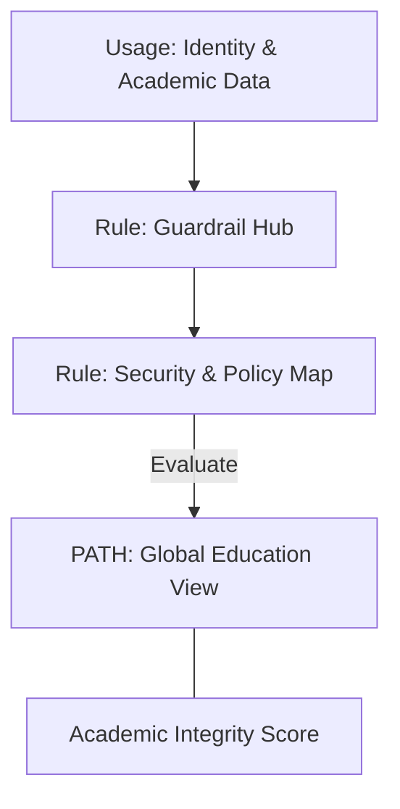

### 5. Multi-Region Campus Federation & Governance Flow
Automatically managing unified education standards across global regions and diverse school districts, ensuring institutional data residency and security boundaries by default.

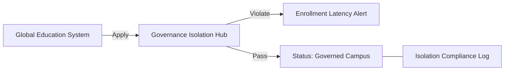

### 6. Encryption & Perimeter Protection Flow (Education Standard)
Managing the lifecycle of an academic request, automatically enforcing institutional TLS 1.3 and resource encryption standards as required by security policy, ensuring zero-latency security confidence.

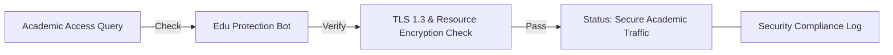

### 7. Institutional Education Maturity Scorecard
Grading organizational performance based on key indicators: FERPA/GDPR Compliance Grade, Student Engagement Adoption Index, and System Uptime.

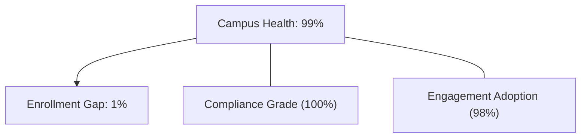

### 8. Identity & RBAC for Education Governance
Managing fine-grained access to education hubs, provisioning workers, and audit logs between Registrars, Faculty, and Students.

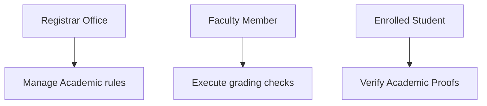

### 9. IaC Deployment: Education-LZ-as-Code Framework
Using modular Terraform to deploy and manage the versioned distribution of the education tracking hubs, contract protection workers, and forensic metadata lakes.

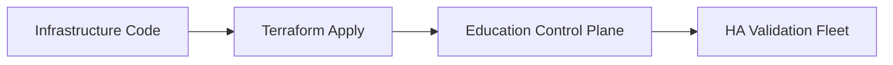

### 10. AIOps Learning Drift & Risk Validation Flow
Using advanced analytics to identify sudden surges in enrollment volume, unauthorized grading changes, suspicious configuration drifts, or unusual learning pattern changes that could result in institutional risk.

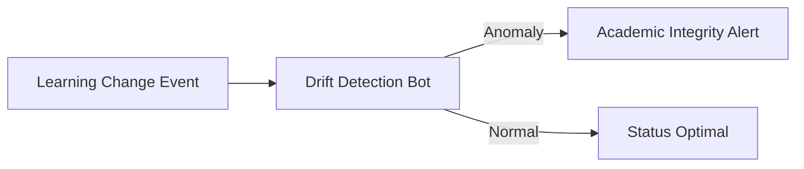

### 11. Metadata Lake for Forensic Education Audit
Storing long-term records of every academic event generated (metadata), every security event recorded, and every student record history for institutional record-keeping, compliance auditing, and post-provisioning forensics.

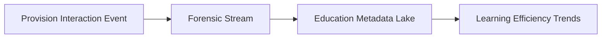

---

## 🏛️ Core Governance Pillars

1.  **Unified Foundation Coordination**: Maximizing resilience by centralizing all academic measurement through a single institutional plane.
2.  **Automated Campus Provisioning**: Eliminating "manual academic silos" through proactive orchestration and pattern verification.
3.  **Sequential Enrollment Intelligence**: Ensuring zero-interruption operations through dependency-aware enrollment-driven campus engineering.
4.  **Zero-Trust Contract Protection**: Automatically enforcing identity-based access and rule evaluation across all education tiers.
5.  **Autonomous Operations Logic**: Guaranteeing reliability through automated industry-specific campus monitoring runbooks.
6.  **Full Campus Auditability**: Immutable recording of every enrollment change and campus provision for institutional forensics.

---

## 🛠️ Technical Stack & Implementation

### Education Engine & APIs
*   **Framework**: Python 3.11+ / FastAPI.
*   **Performance Engine**: Custom Python-based logic for multi-cloud campus provisioning and DORA-style readiness metrics.
*   **Integrations**: Native connectors for Azure, AWS, and GCP Education Service APIs.
*   **Persistence**: PostgreSQL (Education Ledger) and Redis (Live Contract State).
*   **Auth Orchestrator**: Federated OIDC/SAML for least-privilege academic management access.

### Governance Dashboard (UI)
*   **Framework**: React 18 / Vite.
*   **Theme**: Dark, Slate, Indigo (Modern high-fidelity education aesthetic).
*   **Visualization**: D3.js for campus topologies and Recharts for readiness velocity analytics.

### Infrastructure & DevOps
*   **Runtime**: AWS EKS or Azure Kubernetes Service (AKS) for management plane.
*   **Campus Hub**: Managed event sourcing for immutable campus security timeline reconstruction.
*   **IaC**: Modular Terraform for deploying the education landing zone and validation fleet.

---

## 🏗️ IaC Mapping (Module Structure)

| Module | Purpose | Real Services |
| :--- | :--- | :--- |
| **`infrastructure/edu_hub`** | Central management plane | EKS, PostgreSQL, Redis |
| **`infrastructure/enforcers`** | Distributed campus provisioners | Azure, AWS, GCP APIs |
| **`infrastructure/enrollment_pipes`** | Enrollment Ingestion Hubs | Webhooks, Lambda |
| **`infrastructure/auditing`** | Forensic campus sinks | S3, Athena, Quicksight |

---

## 🚀 Deployment Guide

### Local Principal Environment
```bash
# Clone the landing zone platform
git clone https://github.com/devopstrio/education-lz.git
cd education-lz

# Configure environment
cp .env.example .env

# Launch the Edu-LZ stack
make init

# Trigger a mock enrollment update and automated contract validation simulation
make simulate-edu-lz
```

Access the Management Portal at `http://localhost:3000`.

---

## 📜 License
Distributed under the MIT License. See `LICENSE` for more information.

---
<div align="center">
  <p>© 2026 Devopstrio. All rights reserved.</p>
</div>
